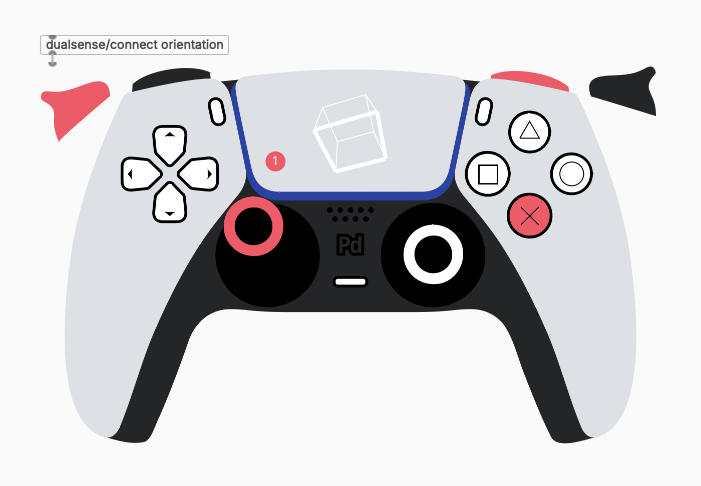

# pd-dualsense
Pd abstraction and Pd-Lua object to connect and display Sony DualSense controller

*(screenshot made with plugdata)*

## usage

* put files in `/dualsense` folder in on of Pd's paths
* create display object via `[dualsense/display]`
* create connection object via `[dualsense/connect]` - its output can be connected to the display object. optional argument `orientation` activates tracking of movement and orientation
* requires a bunch of externals ... pdlua, hidraw, command (maybe more - should all be on deken)

## todos

* proper help files and examples will follow (mainly for documenting the output messages of the [dualsense/connect] object)
* display object is still missing many input messages for customization
* properly document or remove dependencies
