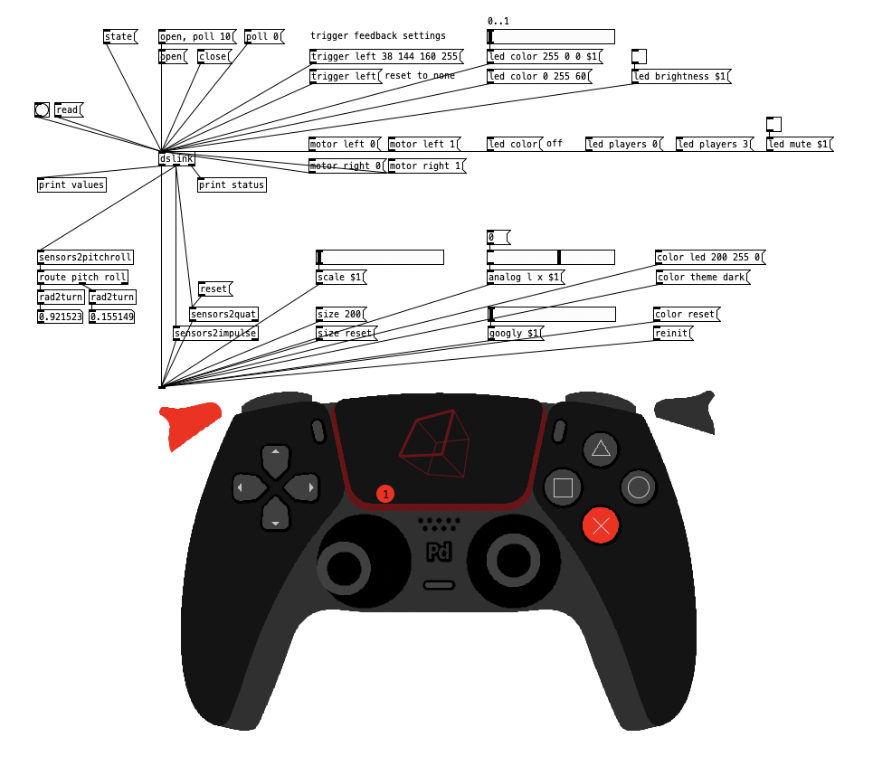

# dualsense library for Pd
Pd external and Pd-Lua object to connect and display Sony DualSense controller

## usage

* extract `dualsense` from latest release into on of your Pd externals folders
* add `dualsense` to your paths or add `[declare -path dualsense]` to your patch
* create `[dslink]` object (its output can be connected to the `[dsshow]` object)
* send `open, poll 10` message to connect to controller and poll data in 10ms intervals
* additionally, you can add `[sensors2quat]` and `[sensors2impulse]` from the second (IMU) outlet of [dslink] and [dsshow] to also display orientation and movement impulses
* obviously, the main purpose is that all messages can be used to control arbitrary patch parameters

## dependencies

* requires `pdlua` external for display (available through deken)

## input messages

see screenshot and code ... more documentation will follow!

## output messages

### left outlet
interaction with controller elements:

| selector  | atom[0] | atom[1] | values | description |
| :--- | :--- | :--- | :--- | :--- |
| analog  | l  | x | -1..1 | left analog stick position |
|         |  | y |  |  |
|         | r  | x | -1..1 | right analog stick position |
|         |  | y |  |  |
| digital | x |   | -1 / 0 / 1 | digital pad directions |
|         | y |   |  |   |
| trigger | l |  | 0..1 | trigger position |
|         | r |  |  |  |
| button  | triangle |  | 0 / 1 | pressed state |
|         | circle   |  |  |  |
|         | cross   |  |  |  |
|         | circle   |  |  |  |
|         | square   |  |  |  |
|         | l1   |  |  |  |
|         | r1   |  |  |  |
|         | l2   |  |  | digital triggers state |
|         | r2   |  |  |  |
|         | l3   |  |  | analog sticks pressed |
|         | r3   |  |  |  |
|         | pad   |  |  | touchpad press |
|         | create   |  |  | additional buttons |
|         | options   |  |  |  |
|         | ps   |  |  |  |
|         | mute   |  |  |  |
| pad     | touch1 |  active | 0 / 1 | if first touch is detected |
|         |        |  x  |  0..1  | touch position |
|         |        |  y  |        |  |
|         | touch2 |  active | 0 / 1 | if second touch is detected |
|         |        |  x  |  0..1  | touch position |
|         |        |  y  |        |  |

### middle outlet 
orientation interaction:

| selector  | atom[0] | values | description |
| :--- | :--- | :--- | :--- |
| gyro  | x  | float | rotational velocity |
|         | y |   |  |
|         | z |   |  |
| accel | x | float | acceleration (seems to be normalized to 1 for earth gravity) |
|         | y |  |  |
|         | z |  |  |

### right outlet 
status information (probably not fully functional yet):

| selector  | atom[0] | values | description |
| :--- | :--- | :--- | :--- |
| battery  | level | 0..9 | battery level (need to recheck scale) |
|         | status |  0 | discharching  |
|         |        |  1 | charging  |
|         |        |  2 | full  |
|         |        |  3 | temperature high (should be its own message) |
|         |        |  4 | temperature low  |
| bluetooth |  | 0 / 1 | 1 if connected via Bluetooth |
| headphones |  | 0 / 1 | 1 if headphones connected |
| microphone |  | 0 / 1 | 1 if microphone connected |
| haptic active |  | 0 / 1 | (need to check - probably not working) |

## todos

* currently only tested on macOS (arm64)
* needs more documentation (mainly all possible message input)
* fixes
* some more features (some of them listed in the issues) 
